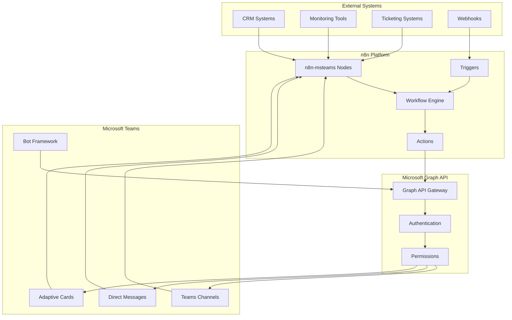

# n8n-msteams

Custom n8n nodes for bidirectional messaging integration with Microsoft Teams.

## Project Purpose

n8n-msteams provides a comprehensive set of custom nodes for n8n that enables seamless bidirectional communication between various systems and Microsoft Teams. This integration allows organizations to automate workflows, send notifications, receive messages, and create interactive experiences directly within Microsoft Teams using the powerful n8n automation platform.

## Solution Architecture



## Features

### Core Messaging Features
- ✅ **Send Messages**: Send text messages, rich cards, and attachments to Teams channels and direct messages
- ✅ **Receive Messages**: React to incoming messages from Teams channels and direct messages
- ✅ **Adaptive Cards**: Create and send interactive Adaptive Cards with buttons, forms, and dynamic content
- ✅ **File Handling**: Upload and download files to/from Teams conversations
- ✅ **Message Formatting**: Support for markdown, mentions, and rich text formatting

### Advanced Integration Features
- ✅ **Webhook Triggers**: Respond to Teams webhook events in real-time
- ✅ **Bot Integration**: Seamless integration with Microsoft Bot Framework
- ✅ **Channel Management**: Create, update, and manage Teams channels programmatically
- ✅ **User Management**: Retrieve user information and manage team memberships
- ✅ **Presence Integration**: Read and update user presence status

### Workflow Automation
- ✅ **Conditional Logic**: Advanced conditional routing based on message content or user actions
- ✅ **Data Transformation**: Built-in data transformation and mapping capabilities
- ✅ **Error Handling**: Comprehensive error handling and retry mechanisms
- ✅ **Logging**: Detailed logging for debugging and monitoring

## Requirements

### System Requirements
- **n8n**: Version 1.0.0 or higher
- **Node.js**: Version 18.0.0 or higher
- **npm**: Version 8.0.0 or higher

### Microsoft Requirements
- **Microsoft 365**: Business or Enterprise subscription
- **Azure AD**: Administrative access for app registration
- **Microsoft Teams**: Access to the target Teams environment
- **Graph API**: Appropriate permissions for your use case

### Permissions Required
The following Microsoft Graph API permissions are typically needed:
- `Chat.ReadWrite` - Read and write chat messages
- `Channel.ReadBasic.All` - Read basic channel information
- `ChannelMessage.Send` - Send messages to channels
- `User.Read.All` - Read user profiles
- `Team.ReadBasic.All` - Read basic team information

## Setup and Configuration

### 1. n8n Installation and Setup

#### Option A: Using npm (Global Installation)
```bash
# Install n8n globally
npm install -g n8n

# Start n8n
n8n start
```

#### Option B: Using Docker
```bash
# Pull and run n8n Docker container
docker run -it --rm --name n8n -p 5678:5678 n8nio/n8n
```

#### Option C: Using Docker Compose
Create a `docker-compose.yml` file:
```yaml
version: '3.8'
services:
  n8n:
    image: n8nio/n8n
    ports:
      - "5678:5678"
    environment:
      - N8N_BASIC_AUTH_ACTIVE=true
      - N8N_BASIC_AUTH_USER=admin
      - N8N_BASIC_AUTH_PASSWORD=your-password
    volumes:
      - n8n_data:/home/node/.n8n
volumes:
  n8n_data:
```

Then run:
```bash
docker-compose up -d
```

### 2. Install n8n-msteams Nodes

#### Option A: Community Package Installation
```bash
# Install from n8n community packages (if published)
npm install -g n8n-nodes-msteams
```

#### Option B: Manual Installation
```bash
# Clone this repository
git clone https://github.com/devopsvanilla/intercom-msteams-hub.git
cd intercom-msteams-hub

# Install dependencies
npm install

# Build the package
npm run build

# Link the package globally
npm link

# In your n8n installation directory
npm link n8n-nodes-msteams
```

### 3. Microsoft Teams and Azure AD Configuration

#### Step 1: Register an Application in Azure AD
1. Go to the [Azure Portal](https://portal.azure.com)
2. Navigate to **Azure Active Directory** > **App registrations**
3. Click **New registration**
4. Fill in the application details:
   - **Name**: `n8n-msteams-integration`
   - **Supported account types**: Select appropriate option for your organization
   - **Redirect URI**: `https://your-n8n-instance.com/oauth/callback`
5. Click **Register**

#### Step 2: Configure API Permissions
1. In your app registration, go to **API permissions**
2. Click **Add a permission** > **Microsoft Graph** > **Application permissions**
3. Add the required permissions:
   - `Chat.ReadWrite.All`
   - `Channel.ReadBasic.All`
   - `ChannelMessage.Send`
   - `User.Read.All`
   - `Team.ReadBasic.All`
4. Click **Grant admin consent**

#### Step 3: Create Client Secret
1. Go to **Certificates & secrets**
2. Click **New client secret**
3. Add a description and set expiration
4. Copy the secret value (you'll need this for n8n configuration)

#### Step 4: Configure Bot (Optional)
If you need bot functionality:
1. Go to [Bot Framework Portal](https://dev.botframework.com)
2. Create a new bot registration
3. Configure the messaging endpoint: `https://your-n8n-instance.com/webhook/msteams-bot`
4. Add Microsoft Teams channel

### 4. n8n Credential Configuration

1. Open n8n interface (`http://localhost:5678`)
2. Go to **Credentials** > **Add Credential**
3. Search for **Microsoft Teams** or **Microsoft Graph**
4. Fill in the credential details:
   - **Client ID**: From your Azure AD app registration
   - **Client Secret**: From your Azure AD app registration
   - **Tenant ID**: Your Azure AD tenant ID
   - **Redirect URL**: `https://your-n8n-instance.com/oauth/callback`
5. Test the connection and save

## Usage Guide

### Basic Message Sending

#### Example 1: Send Simple Text Message
1. Create a new workflow in n8n
2. Add a **Microsoft Teams** node
3. Configure the node:
   - **Operation**: Send Message
   - **Channel**: Select target channel
   - **Message**: Your text message
4. Connect to a trigger (e.g., Webhook, Schedule)
5. Execute the workflow

#### Example 2: Send Adaptive Card
```json
{
  "type": "AdaptiveCard",
  "version": "1.3",
  "body": [
    {
      "type": "TextBlock",
      "text": "Notification from n8n",
      "weight": "Bolder",
      "size": "Medium"
    },
    {
      "type": "TextBlock",
      "text": "Your workflow has completed successfully!",
      "wrap": true
    }
  ],
  "actions": [
    {
      "type": "Action.OpenUrl",
      "title": "View Details",
      "url": "https://your-system.com/details"
    }
  ]
}
```

### Advanced Workflows

#### Example 3: Automated Alert System
```
Webhook Trigger → 
Process Data → 
Condition (Check Severity) → 
Microsoft Teams (Send Alert) → 
Update Database
```

#### Example 4: Interactive Approval Flow
```
Form Submission → 
Microsoft Teams (Send Approval Card) → 
Wait for Response → 
Process Approval → 
Send Notification
```

### Available Nodes

#### Microsoft Teams Trigger
- **Webhook**: Receives incoming messages and events
- **Message Received**: Triggers on new messages in channels
- **Mention**: Triggers when bot is mentioned

#### Microsoft Teams Actions
- **Send Message**: Send text or rich messages
- **Send Adaptive Card**: Send interactive cards
- **Upload File**: Upload files to conversations
- **Create Channel**: Create new Teams channels
- **Get User**: Retrieve user information
- **Update Presence**: Update user presence status

## Uninstall Instructions

### 1. Remove from n8n
1. Stop your n8n instance
2. Remove the package:
   ```bash
   npm uninstall -g n8n-nodes-msteams
   ```
3. Clear n8n cache:
   ```bash
   rm -rf ~/.n8n/nodes/node_modules/n8n-nodes-msteams
   ```

### 2. Clean Up Azure AD
1. Go to Azure Portal > Azure Active Directory > App registrations
2. Find your n8n-msteams application
3. Click **Delete** and confirm

### 3. Remove Bot Registration (if used)
1. Go to Bot Framework Portal
2. Find your bot registration
3. Delete the bot registration

### 4. Clean Up n8n Workflows
1. Export any workflows you want to keep
2. Delete workflows that use Microsoft Teams nodes
3. Remove Microsoft Teams credentials

## Troubleshooting

### Common Issues

#### 1. Authentication Errors
**Symptom**: 401 Unauthorized errors
**Solution**:
- Verify client ID and secret are correct
- Check that admin consent was granted
- Ensure the application has required permissions
- Verify tenant ID is correct

#### 2. Missing Permissions
**Symptom**: 403 Forbidden errors
**Solution**:
- Review required permissions in Azure AD
- Grant admin consent for application permissions
- Check if user has appropriate Teams access

#### 3. Webhook Not Receiving Messages
**Symptom**: Webhook trigger not firing
**Solution**:
- Verify webhook URL is accessible from internet
- Check firewall and network configuration
- Ensure webhook endpoint is properly configured
- Validate the webhook URL in Teams app settings

#### 4. Adaptive Cards Not Rendering
**Symptom**: Cards display as plain text
**Solution**:
- Validate JSON schema using Adaptive Cards Designer
- Check card version compatibility
- Ensure proper content-type headers
- Verify card structure follows Microsoft specifications

#### 5. File Upload Failures
**Symptom**: Cannot upload files to Teams
**Solution**:
- Check file size limits (typically 100MB)
- Verify file type is allowed
- Ensure proper file permissions
- Check available storage space

### Performance Issues

#### Slow Response Times
- Check network latency to Microsoft Graph API
- Optimize workflow logic and reduce unnecessary API calls
- Implement caching where appropriate
- Monitor rate limiting and implement backoff strategies

#### Rate Limiting
- Microsoft Graph API has rate limits
- Implement exponential backoff
- Use batch operations when possible
- Monitor 429 (Too Many Requests) responses

## Log Analysis Tips

### Enable Debug Logging

#### n8n Debug Logging
Set environment variables:
```bash
export N8N_LOG_LEVEL=debug
export N8N_LOG_OUTPUT=console,file
export N8N_LOG_FILE_LOCATION=/var/log/n8n.log
```

#### Application-Specific Logging
Add logging nodes in your workflows:
- Use **Set** node to log variables
- Add **HTTP Request** nodes to external logging services
- Implement custom logging with **Function** nodes

### Important Log Patterns

#### Authentication Issues
```
ERROR: Authentication failed - Invalid client credentials
ERROR: Token expired - Need to refresh authentication
WARNING: Missing required scope - Check API permissions
```

#### API Rate Limiting
```
WARNING: Rate limit approached - Implementing backoff
ERROR: 429 Too Many Requests - Waiting before retry
INFO: Successfully recovered from rate limit
```

#### Webhook Processing
```
INFO: Webhook received - Processing message from Teams
DEBUG: Message content - [message details]
ERROR: Webhook processing failed - [error details]
```

#### Workflow Execution
```
INFO: Workflow started - ID: [workflow-id]
DEBUG: Node execution - [node-name] completed
ERROR: Node failed - [node-name] error: [error-message]
INFO: Workflow completed - Duration: [time]
```

### Log Analysis Tools

#### Built-in n8n Logging
- Use n8n's execution log viewer
- Monitor workflow execution history
- Check node-specific logs and outputs

#### External Logging Solutions
- **ELK Stack**: Elasticsearch, Logstash, Kibana
- **Splunk**: Enterprise log analysis
- **Azure Monitor**: Native Microsoft solution
- **Grafana**: Open-source monitoring and alerting

### Monitoring Best Practices

1. **Set up alerts** for critical workflow failures
2. **Monitor API usage** to avoid rate limits
3. **Track message delivery rates** for reliability metrics
4. **Monitor authentication token expiration**
5. **Log user interactions** for usage analytics

### Support and Resources

- **Documentation**: [Microsoft Graph API Documentation](https://docs.microsoft.com/en-us/graph/)
- **n8n Community**: [n8n Community Forum](https://community.n8n.io/)
- **Microsoft Teams Developer**: [Teams Developer Documentation](https://docs.microsoft.com/en-us/microsoftteams/platform/)
- **Issue Tracking**: Report issues on this repository

## License

MIT License - see [LICENSE](LICENSE) file for details.

## Contributing

Contributions are welcome! Please read our contributing guidelines and submit pull requests for any improvements.

---

**Note**: This project is not officially affiliated with Microsoft or n8n. Microsoft Teams and Microsoft Graph are trademarks of Microsoft Corporation.
